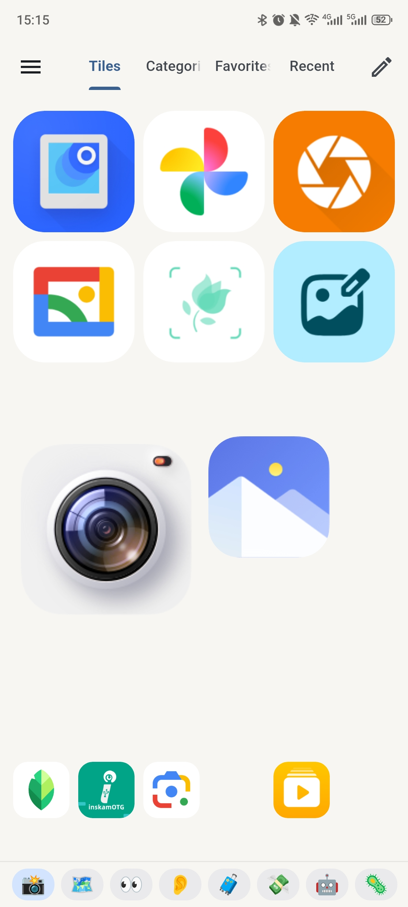
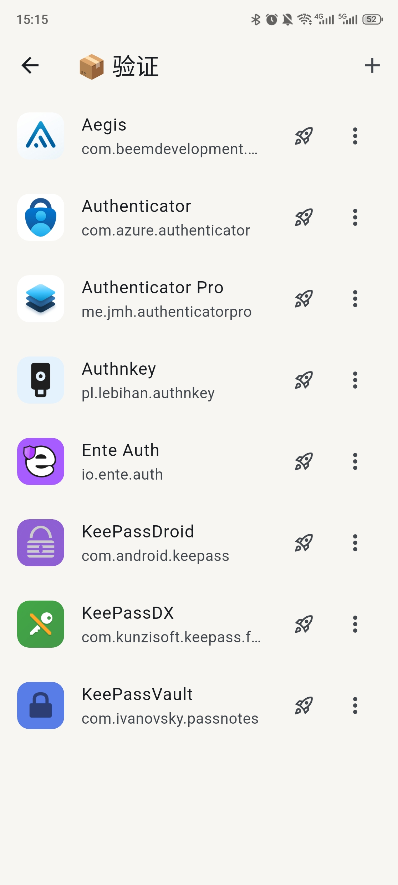
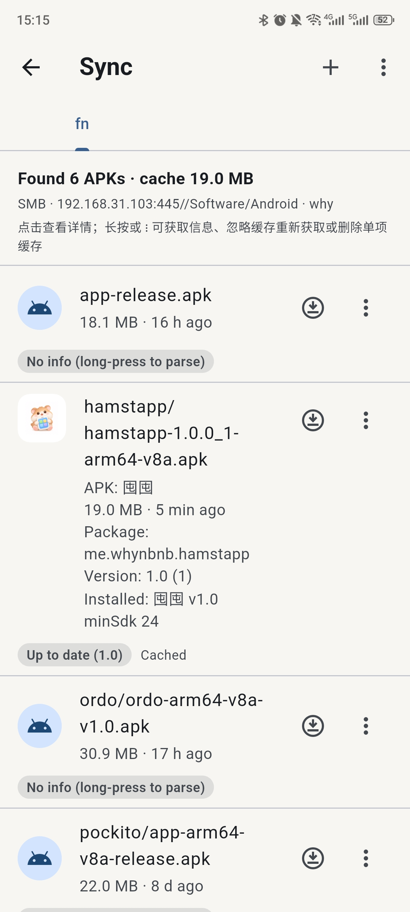

<p align="center">
  
</p>

<h1 align="center">Hamstapp · 囤囤</h1>

<p align="center"><b>A local-first Android app &amp; APK manager, with a fully customisable launcher.</b></p>

<p align="center">
  <b>English</b> ｜ <a href="README.zh-CN.md">简体中文</a>
</p>

<p align="center">
  <a href="https://flutter.dev"></a>
  <a href="https://dart.dev"></a>
  
  
  
  <a href="LICENSE"></a>
</p>

> Vibe-coded with DeepSeek V4.1 Flash / OpenCode

---

**Hamstapp** (囤囤, *tún tún* — “to hoard”) helps you keep track of everything installed on your phone:
why you installed each app, what you were using it for, which apps you actually launch — and turns all of that
into a fast, fully customisable launcher. Everything is stored locally: no account, no analytics, no telemetry.

> **The name** — *Hamstapp* is **Hamster** + **App**: a hamster stuffing apps into its cheeks.
> It pairs with the Chinese 囤囤 (*tún tún*, “to hoard”, pronounced *tún*), so the app is literally a hamster
> that hoards apps for you.

## 📸 Screenshots

<p align="center">
  
  
  
</p>

## ✨ Features

### 🚀 Launch
- **Tile board** — a free-form grid where each app is a tile you can move and resize (1×1 up to 6×6).
  Multiple pages, per-tile label / padding / border, and two looks: **Colorful** and **Glass**.
- **Categories** — group apps with an emoji and a colour; reorder by hand or by name / count.
- **Favorites** — a quick grid of the apps you starred.
- **Recent** — launch history with *all / today / 7-day / 30-day* filters, sorted by recency or frequency,
  plus time-of-day **recommendations** learned from your habits.

### 📦 App manager
- Scan installed apps (optionally including system apps); the list is cached for instant launch.
- Search by **name, package, pinyin initials, full pinyin** or fuzzy subsequence.
- Filter by scope (all / user / system), by state (favorite, categorised, has a reason, unorganized,
  uninstalled…) and by category; sort by name, install time, update time or size.
- Per-app page: launch, favourite, pin to tiles, install **reason**, **note**, categories, usage stats,
  APK analysis, export / share the APK, open the system app-info screen, uninstall.
- **Uninstall records** — when an app disappears it is kept together with the reason you give,
  so reinstalls and snapshots stay meaningful.

### 🗂 Snapshots & backup
- **Snapshots** capture the installed list and all your annotations (including app icons), so you can
  **diff** two points in time (added / removed / updated) and **restore** annotations later.
- **Backup lists** are curated sets of packages with installed / missing counts — handy as reinstall checklists.

### 🌐 Remote APK sources
- Browse and install from **FTP**, **SMB / Samba** and **WebDAV** sources.
- At a glance: new, update, already installed, or newer-than-yours; one-tap download + install.
- Download **cache** with per-file version history, *keep all versions*, orphan cleanup and size reporting.
- **APK analyzer**: SHA-256 / MD5 hashes, manifest flags, component counts, permissions & features,
  native ABIs / DEX / zip breakdown, and v1 / v2 / v3 signing certificates — including a signature
  match check against the installed app before updating.

### 📈 Usage insights
- **Stats** over 7 / 30 / 90 days: most used, **neglected** (used before, then stopped) and never-launched apps.
- **Recommendations** based on the time of day you usually open each app.

### 🔒 Data & privacy
- **Export / import** the whole state as one JSON package.
- A persistent **icon cache** so icons appear instantly, with an on-demand refresh.
- **Offline by default** — the only network access is the remote sources you configure yourself.

### 🎨 Interface
- Light / dark / system theme, custom seed colour, **Chinese & English**.
- Navigation: bottom bar, side rail, or a floating button.
- Adjustable haptics, optional full-screen (hide the status bar), remember last position.

## 📥 Install

Download the latest `hamstapp-*-arm64-v8a.apk` from the [Releases](https://github.com/whynbnb/hamstapp/releases)
page and install it on an **arm64-v8a** device running **Android 7.0+ (API 24)**.

## 🛠 Build from source

Requires the [Flutter SDK](https://docs.flutter.dev/get-started/install) (Dart 3) and the Android SDK.

```bash
git clone https://github.com/whynbnb/hamstapp.git
cd hamstapp
flutter pub get

# Run on a connected device
flutter run

# Slim, obfuscated arm64-v8a release APK -> dist/
bash scripts/release.sh
```

## 🧱 Tech stack

- **Flutter / Dart 3** with `provider` for state, `path_provider` for local JSON storage,
  `lpinyin` for search and `file_picker` for import/export.
- A small **Kotlin** `MethodChannel` plugin on top of the Android `PackageManager`:
  app scan & icons, launching, install / uninstall / share, APK parsing & signing,
  FTP (`commons-net`), SMB (`jcifs-ng`) and vibration.
- **WebDAV** is implemented in Dart over HTTP.

## 📄 License

Released under the [MIT License](LICENSE).

Copyright (c) 2026 0x574859
