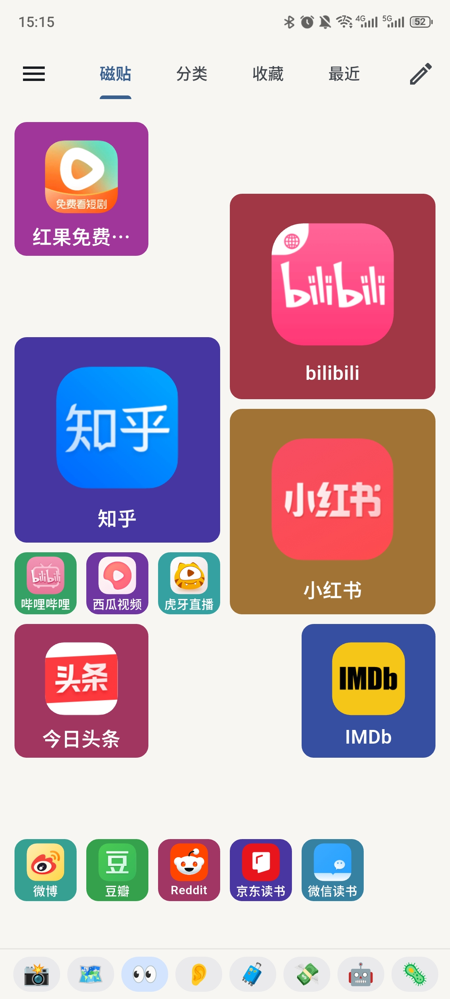
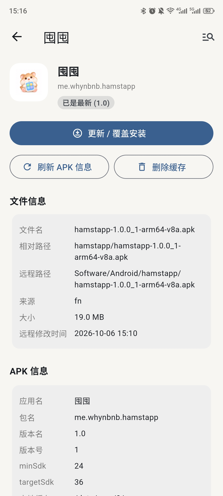
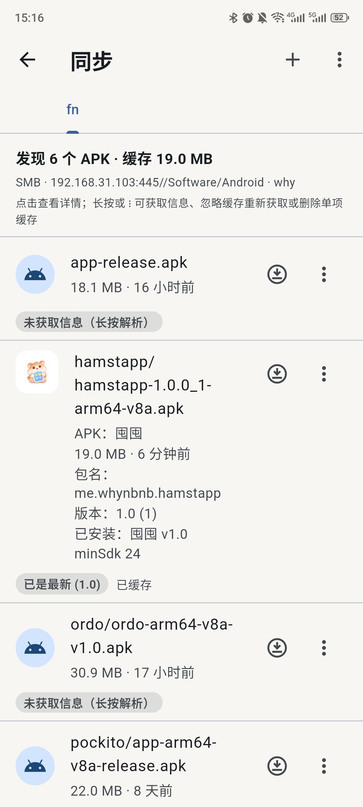

<p align="center">
  
</p>

<h1 align="center">囤囤 · Hamstapp</h1>

<p align="center"><b>本地优先的 Android 应用 / APK 管理器，也是一款可完全自定义的启动器。</b></p>

<p align="center">
  <a href="README.md">English</a> ｜ <b>简体中文</b>
</p>

<p align="center">
  <a href="https://flutter.dev"></a>
  <a href="https://dart.dev"></a>
  
  
  
  <a href="LICENSE"></a>
</p>

> Vibe Coding 而成（DeepSeek V4.1 Flash / OpenCode）

---

**囤囤**（Hamstapp）帮你把手机上装过的应用都理清楚：当初为什么装它、拿它做什么、哪些才是真正常用的——
并把这一切变成一款快速、可完全自定义的启动器。所有数据都保存在本地：没有账号、没有统计、没有遥测。

> **名字含义** —— **Hamstapp** = **Hamster（仓鼠）+ App** 的组合：像一只把应用一股脑囤进腮帮的小仓鼠。
> 这也与中文名「囤囤」（囤积，读 *tún tún*）相呼应——一只替你囤应用的小仓鼠。

## 📸 截图

<p align="center">
  
  
  
</p>

## ✨ 功能

### 🚀 启动
- **磁贴板** —— 自由网格，每个应用都是一块可移动、可缩放的磁贴（1×1 到 6×6）。
  支持多页、单块磁贴的名称 / 内边距 / 边框开关，两种风格：**多彩** 与 **通透**。
- **分类** —— 用 emoji 和颜色给应用分组；可手动排序，或按名称 / 数量排序。
- **收藏** —— 收藏应用的快捷网格。
- **最近** —— 启动历史，支持 *全部 / 今天 / 7 天 / 30 天* 筛选，按最近或频率排序，
  并依据你的使用习惯给出**时段推荐**。

### 📦 应用管理
- 扫描已安装应用（可选是否包含系统应用），列表缓存后秒开。
- 搜索支持**应用名、包名、拼音首字母、全拼、模糊子序列**。
- 按范围（全部 / 用户 / 系统）、状态（收藏、已分类、有理由、未整理、已卸载…）和分类筛选；
  按名称、安装时间、更新时间、大小排序。
- 应用详情页：启动、收藏、置顶到磁贴、安装**理由**、**备注**、分类、使用统计、APK 分析、
  导出 / 分享 APK、打开系统应用信息、卸载。
- **卸载记录** —— 应用消失后会连同你填写的卸载原因一起保留，让重装与快照始终有意义。

### 🗂 快照与备份
- **快照** 记录当前已安装列表与全部标注（含应用图标），因此可以**对比**两个时间点
  （新增 / 卸载 / 更新），之后还能**恢复**标注数据。
- **备份列表** 是自定义的包名集合，显示已安装 / 缺失数量，适合当作重装清单。

### 🌐 远程 APK 源
- 从 **FTP**、**SMB / Samba**、**WebDAV** 源浏览并安装。
- 一眼看出每个远程 APK 是全新、可更新、已安装，还是比本机更新；一键下载并安装。
- 下载**缓存**支持单文件版本历史、*保留所有版本*、孤立缓存清理与体积统计。
- **APK 分析**：SHA-256 / MD5、清单标志、组件数量、权限与特性、原生 ABI / DEX / zip 结构，
  以及 v1 / v2 / v3 签名证书——更新前还会与已安装应用的签名做比对。

### 📈 使用洞察
- **统计**：7 / 30 / 90 天窗口内的最常用、**被冷落**（用过又停用）与从未启动的应用。
- **推荐**：依据你通常在一天中打开各应用的时间给出建议。

### 🔒 数据与隐私
- 把全部状态**导出 / 导入**为单个 JSON 数据包。
- 持久化**图标缓存**，图标即时显示，并可按需刷新。
- **默认离线** —— 唯一的联网行为是你自己配置的远程源。

### 🎨 界面
- 浅色 / 深色 / 跟随系统主题、自定义主题色、**中文与英文**。
- 导航方式：底部导航栏、侧边栏、或悬浮按钮。
- 可调触感反馈、可选全屏（隐藏状态栏）、记忆上次位置。

## 📥 安装

到 [Releases](https://github.com/whynbnb/hamstapp/releases) 下载最新的
`hamstapp-*-arm64-v8a.apk`，在 **arm64-v8a** 设备上安装（**Android 7.0+ / API 24**）。

## 🛠 从源码构建

需要 [Flutter SDK](https://docs.flutter.dev/get-started/install)（Dart 3）与 Android SDK。

```bash
git clone https://github.com/whynbnb/hamstapp.git
cd hamstapp
flutter pub get

# 在已连接设备上运行
flutter run

# 构建精简、混淆的 arm64-v8a 发布版 APK -> dist/
bash scripts/release.sh
```

## 🧱 技术栈

- **Flutter / Dart 3**：使用 `provider` 管理状态、`path_provider` 做本地 JSON 存储、
  `lpinyin` 实现搜索、`file_picker` 处理导入导出。
- 一个基于 Android `PackageManager` 的小型 **Kotlin** `MethodChannel` 插件：
  应用扫描与图标、启动、安装 / 卸载 / 分享、APK 解析与签名、
  FTP（`commons-net`）、SMB（`jcifs-ng`）与振动。
- **WebDAV** 由 Dart 基于 HTTP 实现。

## 📄 许可证

本项目以 [MIT 许可证](LICENSE) 开源。

Copyright (c) 2026 0x574859
